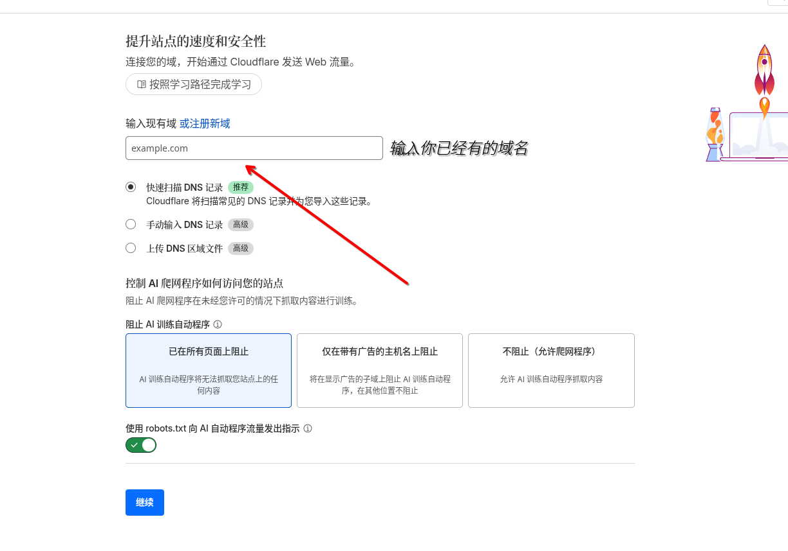
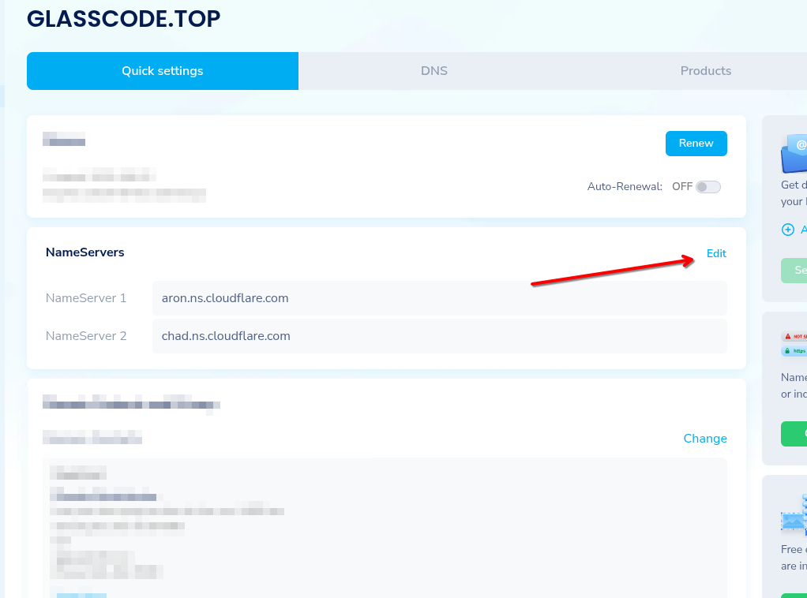

:::note[小贴士]
本文章稍微有点简略，可以理解为备忘
:::
# 将域名托管到赛博活佛
### A.1登陆与注册Cloudflare账户
先确保你能打开Cloudflare仪表板，打不开可以用奇怪魔法。
注册完记得验证。
### A.2托管域名！


然后要求修改ns服务器地址，我用namesilo

修改即可
一阶段完成
# fork项目，克隆与提交更改
### A.1 fork项目
登陆github，打开fuwari的仓库，如图。

(写稿时github抽风了，所以说接下来github相关的无图)
### A.2克隆项目
fork后复制URL直接git clone（该不会真要写git安装教程吧）
`cd fuwari`
我这边用archlinux
`sudo pacman -S nodejs pnpm`
`pnpm install`
### A.3修改，提交更改
修改根目录的`config.ts`
- title：你的博客主标题
- subtitle：你的博客副标题。可选，在首页会显示为“主标题 - 副标题”
- lang：博客显示语言。注释已经列出了一些常用的值
- themeColor：hue值则是你的博客主题色
Other....
修改后可以先`pnpm dev`看看正不正常
第一次使用git需配置
`git config --global user.name "你的github账户名称"`
`git config --global user.email "你的github账户邮箱"`
`ssh-keygen -t rsa`（全部默认，然后到账户根目录的.ssh中找pub,文本编辑器打开，复制里面内容到github创建ssh密钥即可）
`git remote set-url origin git@github.com:xxx/xxx`（xxx内容记得修改！）
然后我们就可以提交更改了
```
git add .
git commit -m "xxx"
git push

```
这时打开github仓库应该就会显示更改
# 与赛博活佛建立连接
在#Workers 和 Pages中创建应用程序，选择pages-导入现有的git存储库。
登陆github账户，选择好仓库，下一步也保持默认即可。
自定义域中修改域名，稍等片刻，就可以访问了。
# 后记
md文档用黑曜石写即可，非常好用
默认的文档记得删除
以后写完文章只需要提交修改，cf即可自动完成善后工作。